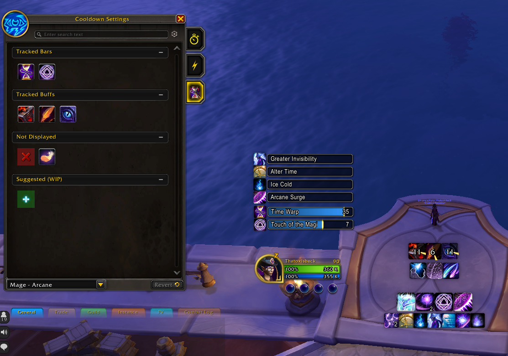
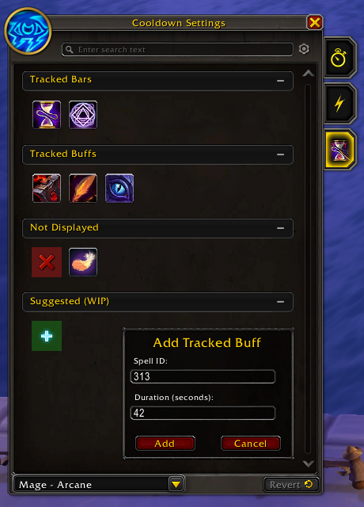
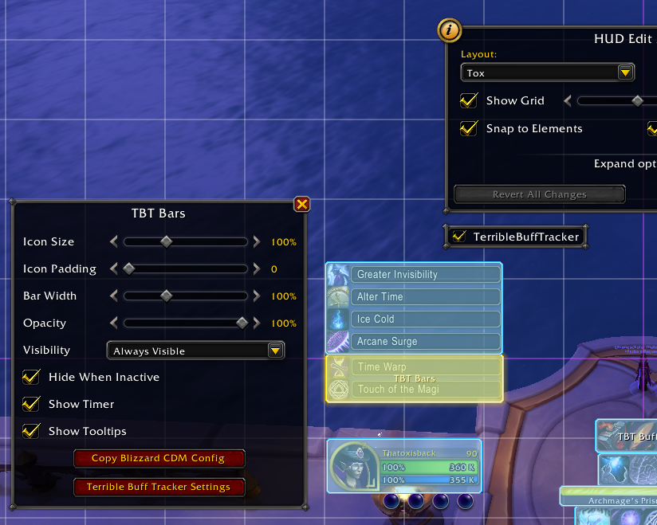

# TerribleBuffTracker

A WoW Midnight addon for tracking buff and cooldown timers that
Blizzard's Cooldown Manager doesn't support — such as active trinket
procs and other effects that lack proper API exposure.

Born from the player need to min-max our characters despite Blizzard's
API pruning in Midnight, TerribleBuffTracker provides a bad way to
track extra buffs, but that's the game we play now. Since combat
events are disabled and buff tracking are a storm of **[Secret
Value]**, the addon uses `UNIT_SPELLCAST_SUCCEEDED` combined with
known durations to track timers manually.

TerribleBuffTracker attempts to integrate directly into Blizzard's
Cooldown Manager, so it feels like a native part of the game's UI. You
configure tracked buffs through a dedicated tab in CDM settings,
drag-and-drop them between display modes, and position the timer
containers independently using Edit Mode.

## AI Usage

This addon was built with the help of [Claude AI](https://claude.ai/).
I'm an experienced Software Developer but very new to Blizzard's API
and game addon/modding development. Claude assisted with learning the
WoW addon API and writing the initial implementation. The addon is
maintained by me to the best of my abilities. Use at your own leisure
— and please complain to Blizzard until they make their UI complete so
we don't need ~~crap~~ stuff like this.

## Showcase

## Features

- Track any spell by ID with a custom duration
- Timer bars and buff icon display modes
- **CDM Settings tab** — "TBT Buffs" tab inside the Cooldown Manager settings window
- **Drag-and-drop** — move buffs between sections or reorder them within a section
- **Edit Mode integration** — two movable containers (Bars and Buffs) with full Edit Mode support
- **Copy Blizzard CDM Config** — one-click import of CDM's current settings into TBT

## Usage

- `/tbt` — Open CDM settings with the TBT Buffs tab selected
- **Add buffs:** Click the "+" icon in the Suggested section, enter a Spell ID and duration
- **Organize:** Drag buffs between Tracked Bars, Tracked Buffs, and Not Displayed sections
- **Configure display:** Enter Edit Mode, click a TBT container, and adjust settings in the popup
- **Quick actions:** Right-click any buff icon for Move, Hide, or Remove options

## Known Issues and Limitations

- Only Active Buffs can be tracked:  
Passive proc trinkets are currently not supported as blizzard's API
hides buff behind secret values while in any relevant contexts

- Tracking Lust:  
Lust can only be tracked if you're the one using lust, since this
logic relies on `UNIT_SPELLCAST_SUCCEEDED` and can't track buffs
directly. If you use lust while with Sated or similar debuff you'll
prorabily see a false positive track

- Buff Removed:  
The addon can't update a buff that has ended before the expected time,
and might linger on screen longer than expected

## License

[WTFPL](LICENSE)
