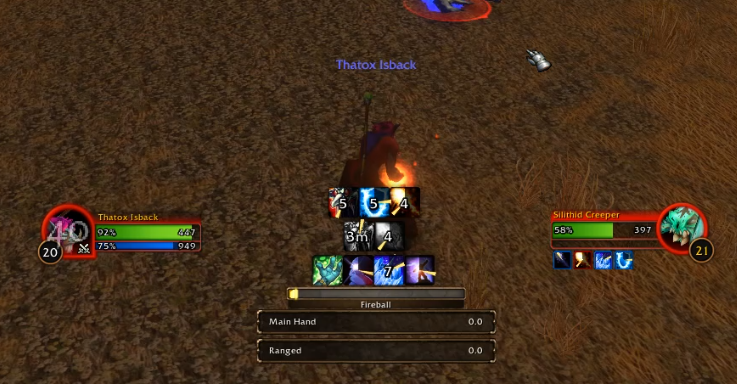

# TerribleBuffTracker

A WoW Cooldown Manager addon for filling the gaps of the Blizzard's
Cooldown Manager (CDM).

TerribleBuffTracker is designed to be used alongside Blizzard's CDM
instead of just replacing it, it's configured through a tab inside the
default CDM window. Positioning and style can be configured through
edit-mode, making it familiar to new users. We also offer limited
(where API restrictions allow us) support to create custom trackers to
extend the CDM, like our built-in **Bloodlust** tracker or the
**Active Racials** on Forever.

## Showcase

## Features

- **Merge Mode** - Enable it on config via `/tbt`: Blizzard's Cooldown
  Manager containers move off screen and their entries are drawn
  inside TBT's matching containers alongside your own trackers. Have
  the CDM buffs bar be centred and have your custom trackers side by
  side with your class base trackers if you want.
- **Buff trackers** - track any spell by ID with a duration you input;
  shown as a bar or an icon
- **Cooldown trackers** - A custom cooldown tracker counts down the
  duration you typed from the moment of the cast, so haste and
  cooldown reduction are not reflected
- **User-created containers** - made as a Buffs container or a
  Cooldowns container with independent config on edit-mode.
- **Edit-Mode integration** - every container drags, and clicking one
  opens a settings popup (icon size, padding, bar width, opacity,
  items per row, growth direction, visibility)
- **Centered growth** on buff icon containers - the row recenters on
  its anchor as buffs come and go
- **Meta-trackers** - Ready-to-use common trackers like: Lust /
  Heroism, Trinket and Damage Potion. These remain as their own
  trackers, with their own durations and bar display
- Mousing over a spell or aura shows its **spell ID** to help you
  create your own custom trackers
- **Racial trackers** - On _Forever_ have an out-of-the-box Racial
  cooldown or buff tracker for your CDM
- **Rank grouping** - On _Forever_, a "cover all ranks" checkbox makes
  one tracker cover every rank of a spell

## Usage

- `/tbt` opens TBT's settings panel under **Options > AddOns**
- I recommend enabling the **Merge Mode** and have custom buffs integrated to Blizzard's CDM
- The Cooldown Manager settings window carries two TBT tabs, **TBT
  Cooldowns** and **TBT Buffs**, sitting beside Blizzard's own tabs
- **Add a tracker:** click the `+` square in the **Suggested**
  section. Enter a spell ID and a duration written as `30s`, `2m`. A
  new tracker lands in **Not Displayed**, and you drag it to the
  container you want it in
- **Containers:** create and delete your own from the settings panel
- **Configure display:** enter edit-mode, click a TBT container, and
  adjust settings in the popup - **Copy Blizzard CDM Config** imports
  the Cooldown Manager's current settings into TBT in one click

## Known Issues and Limitations

- **In restricted content, a buff can keep showing until its input
  duration runs out.** In Mythic+ and other restricted contexts the
  client hides aura data, so TBT's cancellation scan is switched off
  there. Timers still start correctly - a buff that falls off early
  simply stays on screen until its own timer runs down. In **Merge
  Mode** Blizzard's buffs are mirrored from the game's own CDM and
  they bypass these restrictions just like the built-in CDM does

- Custom trackers with **charge counts** will not show charges. The
  client will not report the number, so the icon shows no count rather
  than a wrong one

## AI Usage

This addon was built with the help of [Claude AI](https://claude.ai/).
I'm an experienced Software Developer, but AI allows me to develop
stuff for myself and the community while I game :). Claude assisted
with writing the implementation, but all logic and testing is manually
done by me. The addon is maintained by me to the best of my abilities,
use at your own leisure.

## License

[WTFPL](LICENSE)
